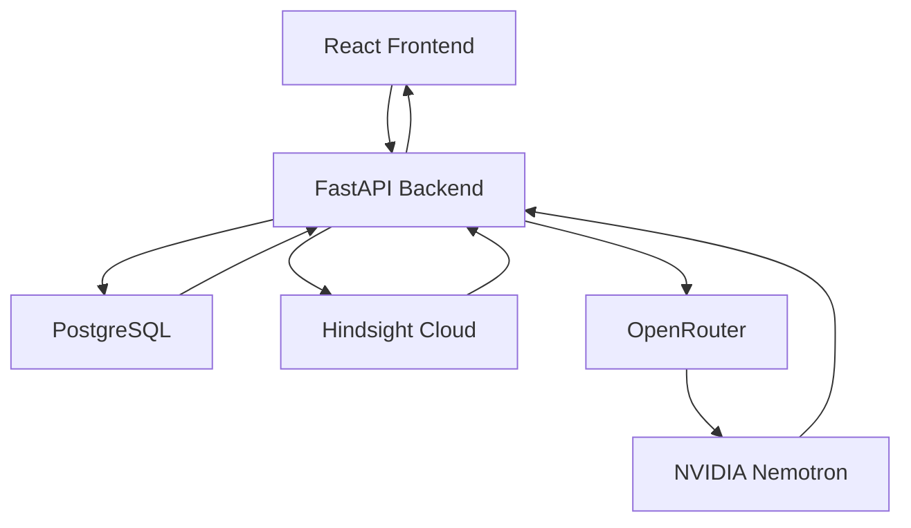

# Triangle

### AI-Powered Deal Intelligence Platform

**Turning customer conversations into actionable deal intelligence.**

<strong>📌 Project Overview</strong>

Triangle is an AI-powered Deal Intelligence Platform designed to help B2B sales representatives and account executives prepare for customer meetings, understand customer concerns, and make informed sales decisions.

By combining AI-powered insights with persistent memory, Triangle retains relevant context from past deal interactions and uses it to generate personalized meeting briefings. This helps sales teams maintain continuity across conversations and preserve important customer information.

<strong>✨ Key Features</strong>

* **Deal Management:** Organize deals and track customer interactions.
* **AI Meeting Briefings:** Generate personalized meeting preparation using deal information and past conversations.
* **Persistent AI Memory:** Retain and retrieve relevant context from previous interactions using Hindsight.
* **Conversation Intelligence:** Retrieve relevant information from previous customer conversations.
* **Objection Analysis:** Identify potential customer concerns and generate suggested responses.
* **Meeting Outcomes:** Record meeting results and preserve important deal context.

<strong>⚙️ How It Works</strong>

1. **Capture:** Store customer interactions and deal information.
2. **Remember:** Use Hindsight to retain relevant context from previous conversations.
3. **Retrieve:** Retrieve useful memories when preparing for a meeting.
4. **Analyze:** Use NVIDIA Nemotron to process deal information and retrieved context.
5. **Generate:** Create personalized meeting briefings and AI-powered insights.

<strong>🛠️ Tech Stack</strong>

| Technology      | Purpose                            |
| --------------- | ---------------------------------- |
| React           | Frontend                           |
| TypeScript      | Frontend development               |
| FastAPI         | Backend API                        |
| PostgreSQL      | Database                           |
| NVIDIA Nemotron | AI-powered analysis and generation |
| OpenRouter      | AI model access                    |
| Hindsight Cloud | Persistent memory                  |

<strong>🧠 System Architecture</strong>

---

**△ Triangle**

*Remember every conversation. Prepare for the next.*

