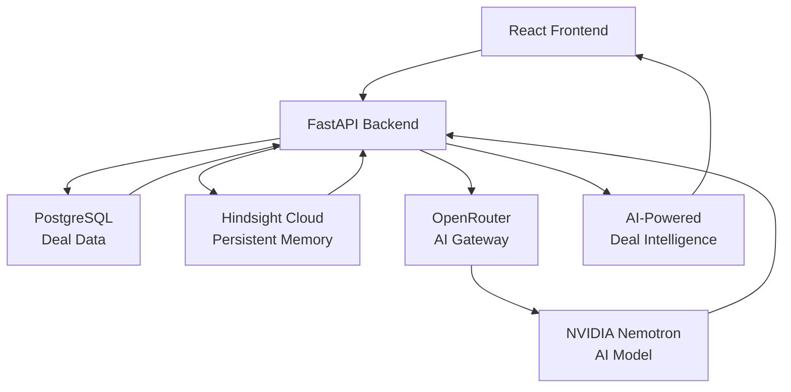

# Triangle

### AI-Powered Deal Intelligence Platform

**Turning customer conversations into actionable deal intelligence.**

<strong>📌 Project Overview</strong>

### 📌 Project Overview

Triangle is an **AI-powered Deal Intelligence Platform** built to help B2B sales representatives and account executives turn customer conversations and deal history into **actionable meeting intelligence**.

Sales teams often need to recall important details from multiple customer interactions—such as requirements, preferences, objections, decisions, commitments, and previous meeting outcomes. Triangle addresses this challenge by combining **AI-powered reasoning with persistent deal memory**, allowing relevant context from earlier interactions to be retained, retrieved, and reused when preparing for future customer meetings.

The platform follows a continuous **Capture → Remember → Retrieve → Analyze → Generate → Learn** workflow. Deal and customer information is captured and stored as persistent context using **Hindsight Cloud**. When a new meeting is being prepared, Triangle retrieves the information most relevant to the current deal and combines it with the latest deal context. This focused information is then processed through **OpenRouter and NVIDIA Nemotron** to identify customer concerns, unresolved requirements, potential objections, previous commitments, discussion points, and follow-up opportunities.

Triangle converts these insights into personalized **meeting preparation summaries, key discussion points, potential objections, suggested responses, important customer context, and follow-up considerations**, which are presented through a React interface.

After each interaction, new meeting outcomes and relevant customer information can be preserved in the deal's memory. This creates a continuous feedback loop in which the platform can maintain context across conversations as the deal progresses.

In short, Triangle is designed to move beyond a basic AI chatbot by combining **deal management, persistent memory, contextual retrieval, and AI-powered reasoning** into a single workflow for sales meeting preparation and deal intelligence.

<strong> Key Features</strong>

Deal & Customer Management: Organize deals, customer information, sales stages, requirements, interactions, and follow-up commitments in one place.
AI-Powered Meeting Briefings: Generate personalized meeting preparation summaries using current deal data and relevant historical conversations.
Persistent AI Memory: Store and retrieve important customer preferences, requirements, objections, decisions, commitments, and meeting outcomes using Hindsight Cloud.
Intelligent Context Retrieval: Retrieve only the most relevant information from previous customer interactions instead of processing the entire conversation history.
AI-Powered Objection Analysis: Identify potential customer concerns, unresolved requirements, and objections, while generating suggested responses and discussion points.
Actionable Deal Intelligence: Transform historical customer information into useful sales signals, including follow-up opportunities, commitments, discussion points, and relevant deal context.
Meeting Outcome Tracking: Capture meeting results, newly discovered requirements, customer concerns, and important decisions for future interactions.
Continuous Learning & Context Updating: Automatically preserve new meeting information in the deal's memory, creating a continuous interaction → memory → retrieval → AI reasoning → outcome feedback loop.
AI-Generated Sales Insights: Provide key discussion points, potential objections, suggested responses, customer context, and follow-up considerations through the React interface.

 
<strong> Capture — Collect Deal & Customer Context</strong>

Triangle begins by collecting structured and unstructured information associated with a deal.

This may include:

Customer and account information
Deal details and sales stage
Previous customer conversations
Meeting notes and outcomes
Customer requirements and preferences
Previously raised objections
Follow-up actions and commitments

The captured information provides the foundation for building a continuously evolving context around each deal.

 
<strong>2️⃣ Remember — Build Persistent Deal Memory</strong>

Instead of treating every interaction as an isolated AI request, Triangle uses Hindsight Cloud as its persistent memory layer.

Relevant information from customer interactions is retained so that important context can be reused in future conversations.

The memory layer helps preserve:

Customer preferences
Previous discussions
Important requirements
Historical objections
Decisions and commitments
Meeting outcomes
Context from earlier interactions

This enables Triangle to maintain continuity across multiple customer interactions.

 
<strong>3️⃣ Retrieve — Find Relevant Context</strong>

When a sales representative prepares for a new meeting, Triangle retrieves the most relevant information from the stored deal context.

Rather than sending the entire conversation history to the AI model, the system focuses on information relevant to the current task.

For example:

Current Meeting
      ↓
Identify Deal Context
      ↓
Retrieve Relevant Memories
      ↓
Combine With Current Deal Data
      ↓
Prepare AI Context

This creates a focused context window for downstream AI reasoning.

 
<strong>4️⃣ Analyze — AI-Powered Deal Reasoning</strong>

The retrieved context is passed through the AI processing layer using OpenRouter and NVIDIA Nemotron.

The model analyzes the available information to identify patterns and useful sales signals such as:

Customer concerns
Unresolved requirements
Potential objections
Important previous commitments
Discussion points
Follow-up opportunities
Relevant deal context

The objective is not simply to generate text, but to transform historical information into actionable deal intelligence.

 
<strong>5️⃣ Generate — Create Personalized Meeting Intelligence</strong>

Based on the retrieved context and AI analysis, Triangle generates personalized outputs for the sales representative.

These can include:

📝 Meeting preparation summaries
🎯 Key discussion points
⚠️ Potential objections
💬 Suggested responses
🔍 Important customer context
📌 Follow-up considerations
🧠 Deal intelligence

The generated information is presented through the React interface so that the sales representative can quickly understand what matters before entering the meeting.

 
<strong>6️⃣ Learn — Preserve New Meeting Outcomes</strong>

After the meeting, new information can become part of the deal's persistent context.

Meeting outcomes, newly discovered requirements, customer concerns, and important decisions can be retained through the memory layer.

This creates a continuous feedback loop:

Interaction
     ↓
Memory
     ↓
Retrieval
     ↓
AI Reasoning
     ↓
Meeting Intelligence
     ↓
Meeting Outcome
     ↓
Updated Memory
     ↺

As a result, Triangle is designed to become increasingly context-aware as the deal progresses.

<strong>🧠 System Architecture</strong>

Why this is stronger

It now clearly represents the four architectural layers:

1. Presentation Layer
React provides the user-facing interface for sales representatives.

2. Application Layer
FastAPI acts as the central coordinator, managing deal information, memory retrieval, and AI processing.

3. Data & Memory Layer
PostgreSQL handles structured deal data, while Hindsight Cloud provides persistent memory for previous customer interactions.

4. AI Intelligence Layer
OpenRouter connects the application to NVIDIA Nemotron, which processes the combined current deal information and retrieved historical context.

---

**△ Triangle**

*Remember every conversation. Prepare for the next.*

